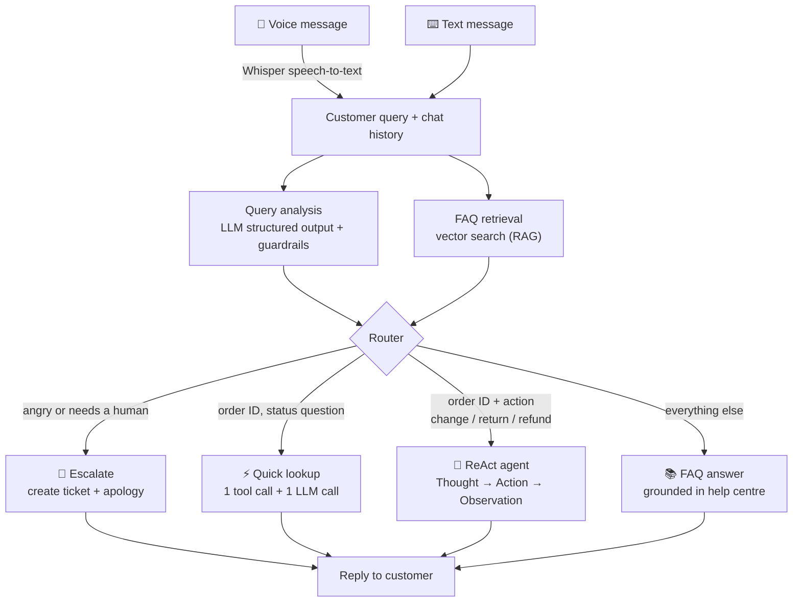

# 🛍️ AI Customer Support Assistant (LangChain + Python)

An AI support agent for a fictional online shop, **ShopEasy**. Customers can type or **speak** a question.
The app works out what they want, searches the help centre, looks up real order data, takes actions such as
changing a delivery address, and escalates angry or sensitive cases to a human with a support ticket.

It runs **free on your own computer** with [Ollama](https://ollama.com), or with OpenAI by changing one line.


**What it demonstrates:** LCEL chains · structured output with Pydantic · RAG · DAG workflows (parallel +
conditional branches) · ReAct prompting and tool use · guardrails · conversation memory · Whisper
speech-to-text · Gradio web UI · offline tests and CI

---

## How it works



The analysis and the FAQ search run **in parallel**, because neither depends on the other. The router then
picks **one** branch. Simple questions take 2 LLM calls; only action requests use the slower agent loop.

| Customer says | Route | What happens |
|---|---|---|
| How long does a UPI refund take? | 📚 FAQ | Retrieves the *Refunds* section → "1-3 working days" |
| Where is my order ORD1002? | ⚡ Quick lookup | Reads the order database → shipped, tracking TRK88457 |
| Change the address on ORD1003 to 21 Park Street, Kolkata | 🤖 Agent | Checks the order is still *Processing*, then updates it |
| I've been charged twice for ORD1004, I want my money back NOW! | 🚨 Escalate | Creates a high-priority ticket and apologises |

Sample order IDs: **ORD1001** to **ORD1008** (see [`data/orders_seed.csv`](data/orders_seed.csv)).

---

## Quick start

You need **Python 3.10+**, **Git**, and either **Ollama** (free) or an **OpenAI API key**.

```bash
git clone https://github.com/YOUR-USERNAME/customer-support-assistant.git
cd customer-support-assistant

python -m venv venv
venv\Scripts\activate            # Windows
# source venv/bin/activate       # Mac / Linux

pip install -r requirements.txt
```

**Models (Ollama, free):**

```bash
ollama pull llama3.2
ollama pull nomic-embed-text
```

**Settings:** copy `.env.example` to `.env` (`copy .env.example .env` on Windows). The defaults already use
Ollama. To use OpenAI instead, follow the comments in the file.

**Voice input** needs [FFmpeg](https://ffmpeg.org) (`winget install ffmpeg` on Windows, `brew install ffmpeg`
on Mac, then restart the terminal).

**Run the app:**

```bash
python app.py
```

Open **http://127.0.0.1:7860**. Wait for `✅ Model warmed up` in the terminal before your first question.

---

## Project structure

```
customer-support-assistant/
├── app.py                      Gradio web app: chat, voice, "behind the scenes" panel
├── config.py                   Loads .env; creates the LLM and embedding models
├── step1_basic_chain.py        Prompt | LLM | parser — invoke, batch, stream
├── step2_structured_output.py  Pydantic classification + rule-based guardrails
├── step3_react_agent.py        ReAct loop built by hand + LangChain's create_agent
├── step4_dag_workflow.py       Full pipeline: parallel stage + 4-way router
├── step5_speech_to_text.py     Whisper transcription plugged into the pipeline
├── knowledge_base.py           Splits the FAQ, embeds it, vector search (RAG)
├── tools.py                    Agent tools: order lookup, address change, FAQ search, tickets
├── reset_data.py               Restores the sample orders and deletes tickets
├── data/
│   ├── faq.md                  Help-centre policies (the knowledge base)
│   └── orders_seed.csv         Sample orders (copied to orders.csv on first run)
├── docs/                       📖 Step-by-step guide to building this from scratch
├── tests/                      Offline tests (no LLM or API key needed)
├── .github/workflows/tests.yml Runs the tests on every push
├── requirements.txt            App dependencies
├── requirements-dev.txt        Lightweight dependencies for the tests
└── .env.example                Settings template (copy to .env)
```

---

## 📖 Build it yourself: step-by-step guide

The [`docs/`](docs/README.md) folder walks through building the whole project from an empty folder, one
concept at a time, with the code, the reasoning behind it, expected output, and the problems you'll hit.

| # | Chapter | You'll learn |
|---|---|---|
| 1 | [Setup](docs/01-setup.md) | Python, virtual environment, Ollama/OpenAI, `.env`, `config.py` |
| 2 | [Your first chain](docs/02-first-chain.md) | Prompt templates, LCEL `\|`, `invoke` / `batch` / `stream` |
| 3 | [Structured output](docs/03-structured-output.md) | Pydantic models, classification, guardrails |
| 4 | [Knowledge base (RAG)](docs/04-knowledge-base-rag.md) | Chunking, embeddings, vector search |
| 5 | [Tools](docs/05-tools.md) | `@tool`, docstrings as instructions, safe actions |
| 6 | [ReAct agent](docs/06-react-agent.md) | Thought → Action → Observation, parsing, loop safety |
| 7 | [DAG workflow](docs/07-dag-workflow.md) | `RunnableParallel`, `RunnableBranch`, routing design |
| 8 | [Speech-to-text](docs/08-speech-to-text.md) | Whisper locally or via API |
| 9 | [Web app](docs/09-web-app.md) | Gradio Blocks, streaming status, custom styling |
| 10 | [Testing](docs/10-testing.md) | Testing LLM apps without calling the LLM |
| 11 | [Publish on GitHub](docs/11-github.md) | Git, `.gitignore`, pushing, CI badge |
| — | [Troubleshooting & lessons learned](docs/troubleshooting.md) | Real problems from building this, and the fixes |

---

## Run each step on its own

```bash
python step1_basic_chain.py          # first chain
python step2_structured_output.py    # classification as JSON
python knowledge_base.py             # FAQ retrieval
python tools.py                      # tools, no LLM needed
python step3_react_agent.py          # watch the agent think and act
python step4_dag_workflow.py         # full pipeline with routing and timings
python step5_speech_to_text.py my_question.wav
python app.py                        # the complete app
python reset_data.py                 # restore the sample data
pytest                               # run the tests (pip install -r requirements-dev.txt)
```

## Performance

On a CPU-only laptop with `llama3.2`, most answers take roughly 10-40 seconds; the agent route takes longer.
With `openai:gpt-4o-mini` most answers take 2-5 seconds. The **response time** card in the app shows the real
figure for every message. See [troubleshooting](docs/troubleshooting.md#its-slow) for speed tips.

## Ideas to extend it

1. Persist the vector store with FAISS or Chroma instead of rebuilding it on every start.
2. Add a `cancel_order` tool that only works for orders that haven't shipped.
3. Reply by voice with text-to-speech.
4. Rebuild the router with LangGraph to add retries and human approval before actions.
5. Log every conversation and route, then build an analytics dashboard.
6. Deploy the app on Hugging Face Spaces.

## License

[MIT](LICENSE)
